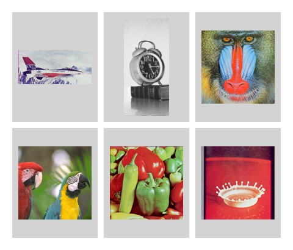
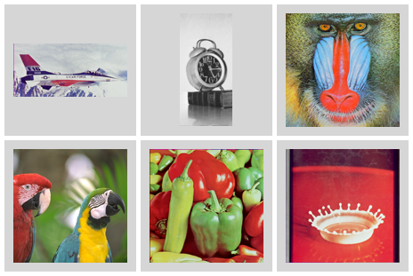
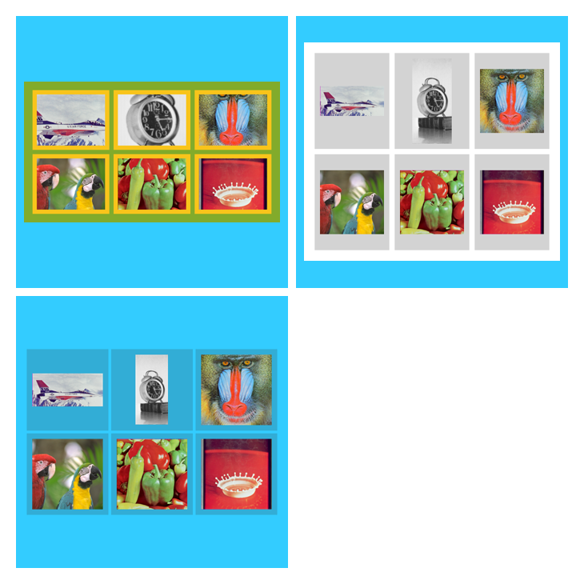

# contactsheet-go

画像ファイルからコンタクトシート（サムネイルグリッド）を生成するGoのCLIツールです。

## 概要

contactsheet-goは、指定されたディレクトリの画像ファイルからコンタクトシートを生成するコマンドラインツールです。画像をグリッドレイアウトで配置し、タイルサイズ、行・列数、マージン、パディング、補間方法、背景色などのオプションをカスタマイズできます。

画像の各タイルへの配置方法を選択できます：

- **crop**: タイル領域を埋めるように画像を切り抜く（中央部分を切り抜き）
- **fit**: アスペクト比を保持しながらタイル内に収める（中央配置）

## 例

- crop

```bash
go run . -i ./examples/images -o ./examples/out \
  -r 2 -c 3 -w 160 -h 120 \
  --tilemode crop \
  --prefix "crop_2x3_" \
  --background-color "#82ab2b" \
  --tile-background-color "#f8c41b"
```


- fit

```bash
go run . -i ./examples/images -o ./examples/out \
  -r 2 -c 3 -w 120 -h 160 \
  --tilemode fit --prefix "fit_2x3_"
```



- 背景透過

```bash
go run . -i ./examples/images -o ./examples/out \
  -r 2 -c 3 -w 128 -h 128 \
  --tilemode fit \
  --prefix "transparent_3x3_" \
   --background-color "#00000000" \
   --tile-background-color "#33333333" \
   --inner-margin 5 --outer-margin 5 --padding 10
```



- コンタクトシートのコンタクトシート

```bash
go run . -i ./examples/out -o ./examples -r 2 -c 2 \
  --tile-background-color #33ccff
```




サンプル画像の引用元: http://www.ess.ic.kanagawa-it.ac.jp/app_images_j.html

## 使用方法

```bash
./contactsheet -i <入力ディレクトリ> -o <出力ディレクトリ> [オプション]
```

### 基本例

```bash
./contactsheet -i ./images -o ./out -r 5 -c 4 -w 320 -h 320 --tilemode fit
```

この例では、`./images`ディレクトリの画像から5x4のコンタクトシートを作成し、各画像を320x320ピクセル内に収め、結果を`./out`に保存します。

### オプション

| フラグ | 短縮形 | デフォルト値 | 説明 |
|--------|--------|-------------|------|
| `--indir` | `-i` | - | 入力ディレクトリ（必須） |
| `--outdir` | `-o` | - | 出力ディレクトリ（必須） |
| `--rows` | `-r` | 5 | 行数 |
| `--cols` | `-c` | 5 | 列数 |
| `--width` | `-w` | 320 | タイル幅（ピクセル） |
| `--height` | `-h` | 320 | タイル高さ（ピクセル） |
| `--prefix` | `-p` | "out_" | 出力ファイル名のプレフィックス |
| `--tilemode` | - | "fit" | タイルモード（`fit` または `crop`） |
| `--interpolator` | - | "CatmullRom" | 補間方法（`n`=NearestNeighbor, `a`=ApproxBiLinear, `b`=BiLinear, `c`=CatmullRom） |
| `--background-color` | - | "white" | 背景色（`white` , `black`, `#RRGGBB`, `#RRGGBBAA`） |
| `--tile-background-color` | - | "#D3D3D3" | タイル背景色（`white` , `black`, `#RRGGBB`, `#RRGGBBAA`） |
| `--inner-margin` | - | 10 | 内側マージン（ピクセル） |
| `--outer-margin` | - | 20 | 外側マージン（ピクセル） |
| `--padding` | - | 10 | パディング（ピクセル） |

## 対応フォーマット

- **入力**: PNG, JPEG, BMP
- **出力**: PNG

## 今後のアイデア

将来的に実装を検討している機能:

- **出力形式の拡張**: PNG以外にJPEG形式での出力に対応
- **ファイル名表示**: コンタクトシート上に画像ファイル名を表示する機能
- **マージン・パディングの柔軟化**: 上下左右を個別に設定可能にする
- **アスペクト比対応レイアウト**: 画像のアスペクト比に合わせたフレキシブルなタイル配置機能
- **EXIF日付ソート**: EXIF情報の撮影日時による画像ソート機能
